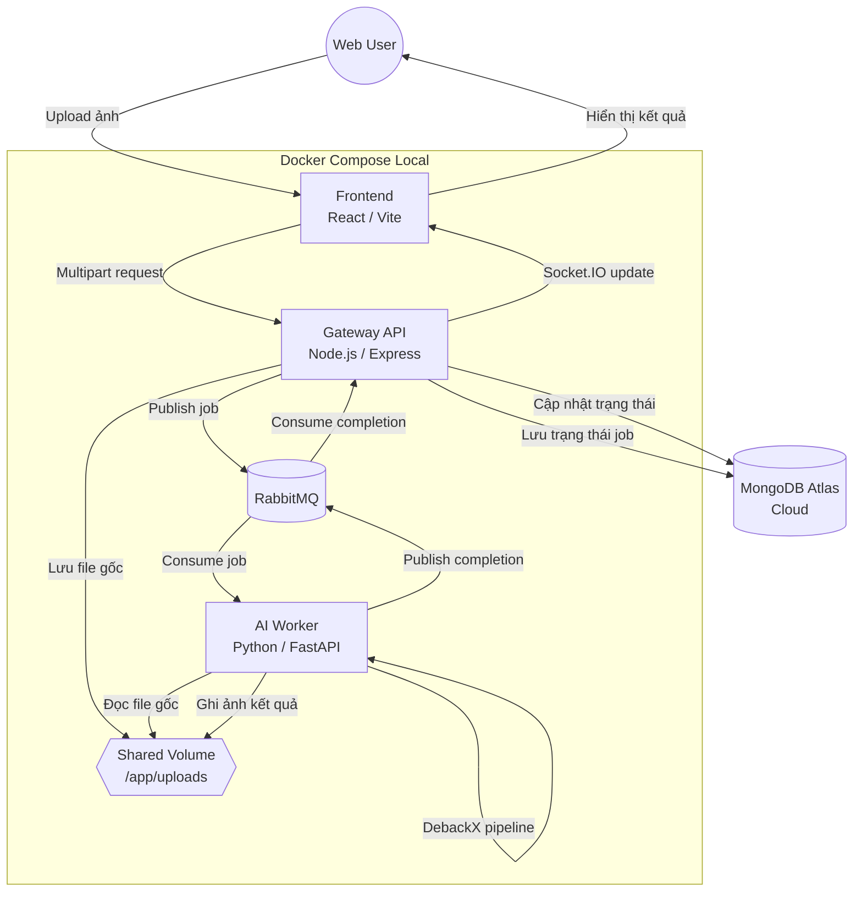

# ThesisHCMUS - DebackX Local Distributed Architecture

Nền móng project này tách luồng giao tiếp web khỏi luồng suy luận AI để tránh việc request HTTP bị treo khi DebackX xử lý ảnh lâu. Node.js Gateway nhận upload, lưu trạng thái và đẩy job vào RabbitMQ. Python Worker nhận job, đọc ảnh từ Docker shared volume, xử lý ảnh, ghi kết quả lại cùng volume và gửi message hoàn tất cho Gateway.

## Kiến trúc



## Cấu trúc dự án

```text
apps/
  web/
    src/
      app/                         React app shell, global styles
      features/
        image-translation/         Tính năng chính: upload ảnh, theo dõi job, xem kết quả
          api/                     API client cho image translation
          components/              UI riêng của tính năng dịch ảnh
          hooks/                   Realtime job state, Socket.IO subscription
      shared/
        config/                    Cấu hình dùng chung phía frontend
        ui/                        UI primitives có thể tái sử dụng

services/
  gateway/
    src/
      config/                      Environment config
      infrastructure/
        database/                  MongoDB connection
        messaging/                 RabbitMQ publisher/consumer wrapper
        storage/                   Upload/shared-volume handling
      modules/
        image-translation/         Route, repository, serializer, completion consumer
      index.js                     Bootstrap Express + Socket.IO

  worker/
    app/
      core/                        Worker settings
      infrastructure/
        messaging/                 RabbitMQ worker loop
      modules/
        image_translation/         Processor và pipeline DebackX
      main.py                      FastAPI healthcheck + worker bootstrap

workflow/baseline.md               Baseline Mermaid ban đầu
docker-compose.yml                 RabbitMQ, Gateway, Worker, Web, shared volumes; MongoDB Atlas qua MONGO_URL
```

Nguyên tắc mở rộng: tính năng mới nên tạo module riêng trong `services/gateway/src/modules`, `services/worker/app/modules` và `apps/web/src/features`. Hạ tầng dùng chung như database, queue, storage, socket, config không đặt lẫn vào code feature.

## Chạy local

```bash
cp .env.example .env
# sửa MONGO_URL trong .env thành connection string MongoDB Atlas của bạn
docker compose up --build
```

`MONGO_URL` nên có tên database, ví dụ `/debackx`, để Gateway ghi đúng database trên Atlas. Nếu password có ký tự đặc biệt như `@`, `#`, `%`, cần URL-encode trong connection string.

Sau khi các container sẵn sàng:

- Web UI: `http://localhost:5173`
- Gateway API: `http://localhost:3000/api/health`
- Worker health: `http://localhost:8000/health`
- RabbitMQ console: `http://localhost:15672` với `guest / guest`

## API chính

- `POST /api/image-translations/jobs` nhận multipart field `image`, tạo job và trả `202 Accepted`.
- `GET /api/image-translations/jobs/:jobId` lấy trạng thái job.
- `GET /api/image-translations/jobs/:jobId/result` trả ảnh kết quả khi job `completed`.
- Socket.IO event `image-translation:join-job` nhận `jobId`; Gateway emit `image-translation:job-update` khi worker hoàn tất.

## Message contract

Request queue `image.translate.requested`:

```json
{
  "jobId": "uuid",
  "inputFile": "uuid.png",
  "outputFile": "uuid.vi.png",
  "requestedAt": "2026-05-13T00:00:00.000Z"
}
```

Completion queue `image.translate.completed`:

```json
{
  "jobId": "uuid",
  "ok": true,
  "outputFile": "uuid.vi.png",
  "durationMs": 1200,
  "worker": "debackx-worker-1"
}
```

## Điểm thay DebackX thật

Hiện tại `services/worker/app/modules/image_translation/pipeline.py` đang dùng placeholder bằng Pillow để scaffold chạy được. Khi tích hợp model thật, thay nội dung `run_debackx_placeholder(input_path, output_path)` bằng inference DebackX và giữ nguyên hợp đồng input/output file path.
